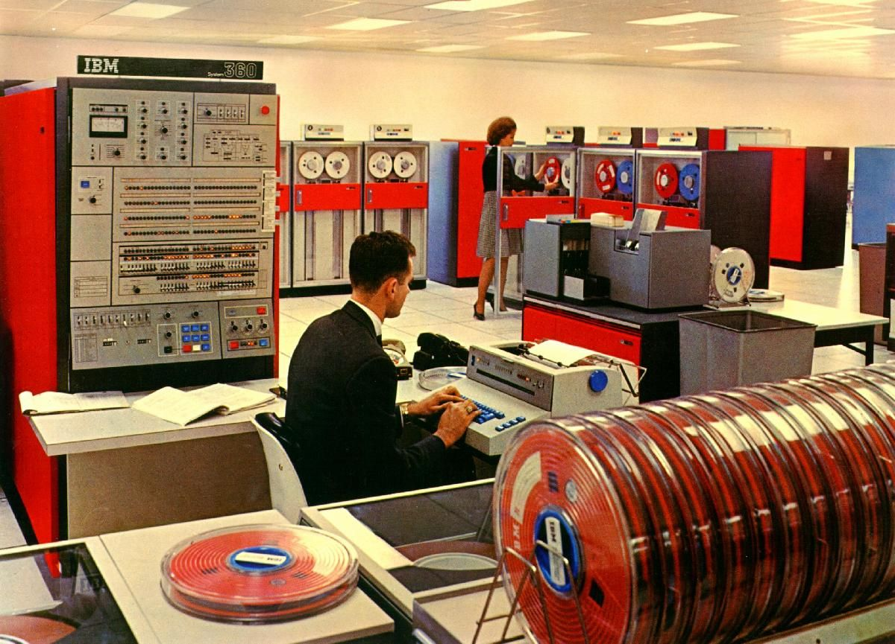
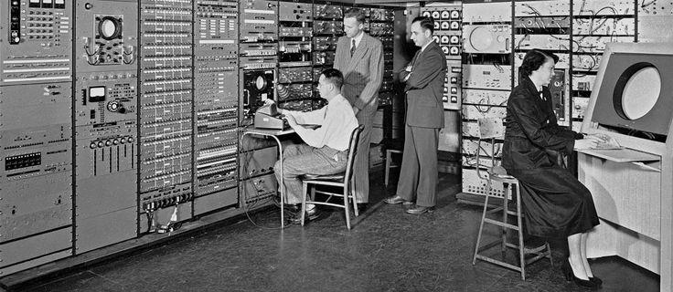

# My-Lab
My Lab is just my code labor and list of my projects.

one place for everything to learn code.

**SYNO** `code lab`, `research lab`, `proof of concept lab`, `code laboratory`

&nbsp;
&nbsp;

&nbsp;
&nbsp;

## Board:

- [(My-Lab-Board)](https://github.com/users/ShmuelMofrad/projects/1): small kanban/scrum board.

## Projects:

- [Java-Lab or Italian breakfast](https://github.com/ShmuelMofrad/Java-Lab): Java-Lab also called **Italian breakfast**. main learning package about java development, with a step-by-step guidance and java code examples.
- [Web-Lab or tomato soup](https://github.com/ShmuelMofrad/tomato-soup): **tomato soup** is a learning package for beginners about Web development.  
- [~~Web-Lab~~](https://github.com/ShmuelMofrad/Web-Lab)
- [~~angular-stackblitz-start~~](https://github.com/ShmuelMofrad/angular-stackblitz-start)
- [~~my-first-angular-project~~](https://github.com/ShmuelMofrad/my-first-angular-project)
- [~~TypeScript-SNAPSHOT~~](https://github.com/ShmuelMofrad/TypeScript-SNAPSHOT)

&nbsp;
&nbsp;

##### 2022 samuel mofrad